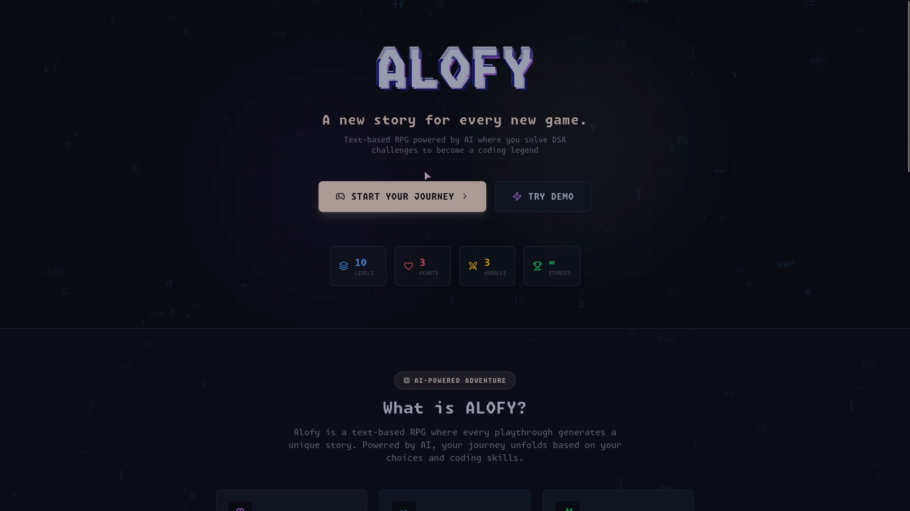
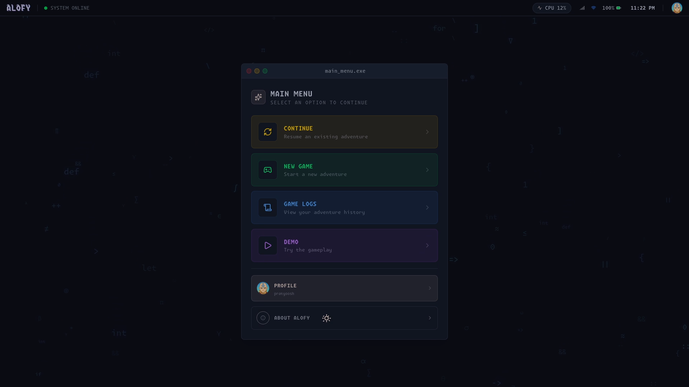
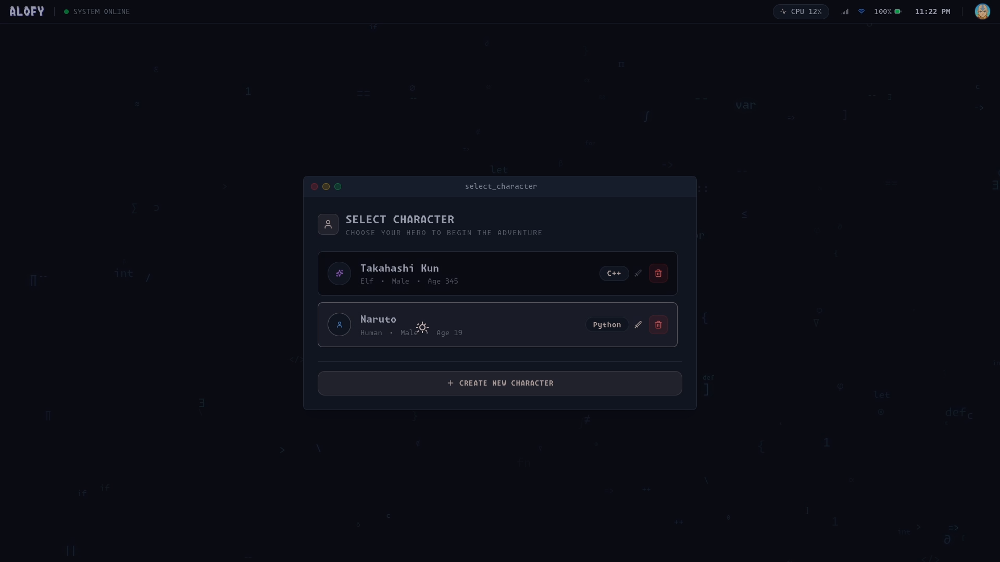
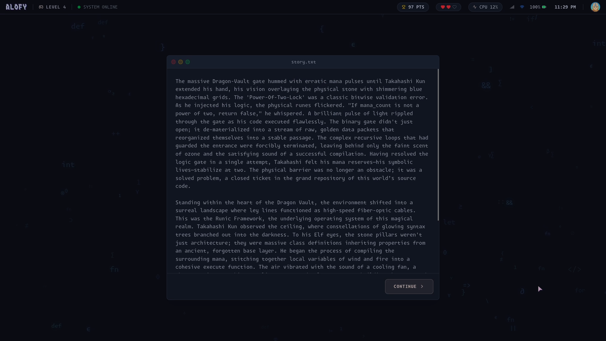
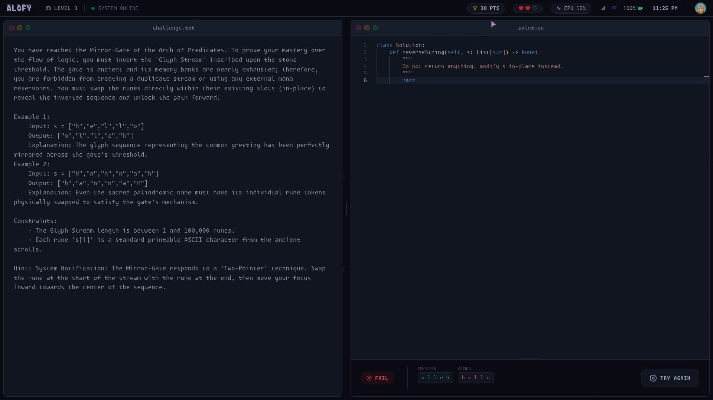
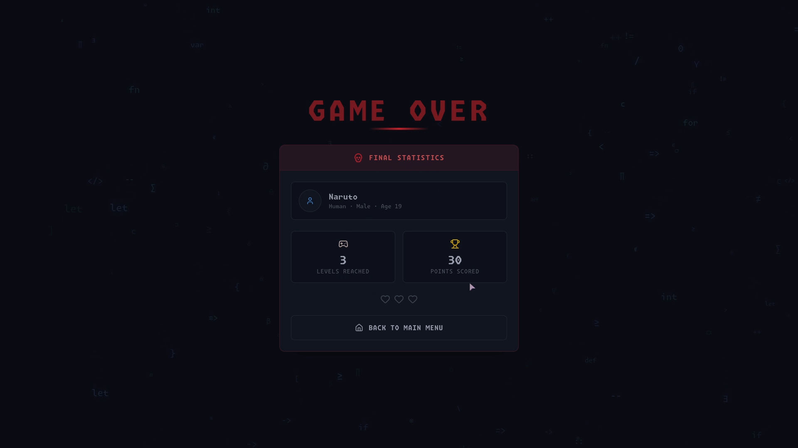

<div align="center">

### ✨ A new story for every new game ✨

**AI-Powered Text-Based RPG where you solve DSA challenges to become a coding legend**

[](https://github.com/rlpratyoosh)
[](https://linkedin.com/in/rlpratyoosh)
[](https://github.com/rlpratyoosh/Alofy)

</div>

---

## 🎮 What is Alofy?

Alofy is a **text-based RPG game powered by AI** where every playthrough generates a unique story. Your journey unfolds based on your choices and coding skills as you face Data Structures and Algorithms (DSA) challenges to progress through the adventure.

### 🌟 Key Features

| Feature | Description |
|---------|-------------|
| 🤖 **AI-Generated Stories** | Every game creates a unique narrative tailored to your character and choices |
| 📚 **10 Levels** | Progress through 10 unique levels with AI-generated story content |
| ❤️ **3 Hearts** | You start with 3 lives - fail a hurdle and lose a heart |
| ⚔️ **3 Hurdles** | Boss battles at levels 3, 6, and 9 with DSA coding challenges |
| 🎭 **Character Creation** | Choose your race, name your hero, and select your coding class |
| 🎓 **Learn DSA** | Master data structures and algorithms while enjoying an immersive RPG experience |

### 👤 Character Classes

Choose your coding language of choice:

| Class | Language |
|-------|----------|
| 🐍 **Python** | Python 3.x |
| ☕ **Java** | Java 15.x |
| ⚡ **C++** | C++ 10.x |

---

## 📸 Screenshots

<div align="center">

<!-- Add your screenshots here -->

| Landing Page | Game Menu |
|:------------:|:---------:|
|  |  |

| Character Creation | Gameplay |
|:------------------:|:--------:|
|  |  |

| Code Editor | Game Over Screen |
|:-----------:|:--------------:|
|  |  |

</div>


---

## 🛠️ Tech Stack

<div align="center">

[](https://nextjs.org/)
[](https://nestjs.com/)
[](https://turbo.build/)
[](https://www.typescriptlang.org/)
[](https://www.postgresql.org/)
[](https://redis.io/)
[](https://www.prisma.io/)
[](https://www.docker.com/)
[](https://www.nginx.com/)
[](https://tailwindcss.com/)
[](https://jwt.io/)
[](https://zod.dev/)
[](https://pnpm.io/)
[](https://socket.io/)
[](https://microsoft.github.io/monaco-editor/)

</div>

### Architecture

```
alofy/
├── apps/
│   ├── web/          # Next.js frontend
│   └── api/       # NestJS backend
├── packages/
│   ├── db/           # Prisma database package
│   ├── types/        # Shared TypeScript types
│   └── schema/       # Shared Schemas
└── docker/           # Docker configurations
```

---

## 🚀 Getting Started

### Prerequisites

- Node.js 24
- pnpm
- Docker & Docker Compose
- PostgreSQL
- Redis
- Piston

### Installation

1. **Clone the repository**
   ```bash
   git clone https://github.com/rlpratyoosh/alofy.git
   cd alofy
   ```

2. **Install dependencies**
   ```bash
   pnpm install
   ```

3. **Set up environment variables**
   ```bash
   cp .env.example .env
   cp /packages/database/.env.example /packages/database/.env
   cp /apps/api/.env.example /apps/api/.env
   cp /apps/web/.env.example /apps/web/.env

   # Edit .env with your configuration
   ```

4. **Start the database**
   ```bash
   docker-compose up -d
   ```

5. **Run database migrations**
   ```bash
   pnpm db:migrate
   ```

6. **Start the development server**
   ```bash
   pnpm dev
   ```

---

## 🎯 How to Play

1. **Create Your Character** - Choose your race, name your hero, and select your coding class (Python, Java, or C++)

2. **Embark on Your Journey** - Progress through 10 levels with AI-generated story content

3. **Face the Hurdles** - At levels 3, 6, and 9, solve DSA coding challenges to continue

4. **Claim Victory** - Complete all 10 levels to become a coding legend!

### Game Rules

- 🔴 **3 Hearts** - Fail a hurdle and lose a heart. Lose all hearts = Game Over
- ⚔️ **3 Hurdles** - Boss battles at levels 3, 6, and 9 with DSA challenges
- 🏆 **10 Levels** - Each level features unique AI-generated story content

---

## 🤝 Contributing

Contributions are welcome! Please feel free to submit a Pull Request.

1. Fork the repository
2. Create your feature branch (`git checkout -b feature/AmazingFeature`)
3. Commit your changes (`git commit -m 'Add some AmazingFeature'`)
4. Push to the branch (`git push origin feature/AmazingFeature`)
5. Open a Pull Request


---

## ⚠️ Development Status

<div align="center">

# 🚧 Under Active Development 🚧

*Some features may be incomplete or subject to change*

</div>

---

## 📬 Contact

<div align="center">

[](https://github.com/rlpratyoosh)
[](https://linkedin.com/in/rlpratyoosh)

</div>

---

<div align="center">

**Bringing fun to DSA learning** 🎮✨

Made with ❤️ by [Pratyoosh](https://github.com/rlpratyoosh)


</div>